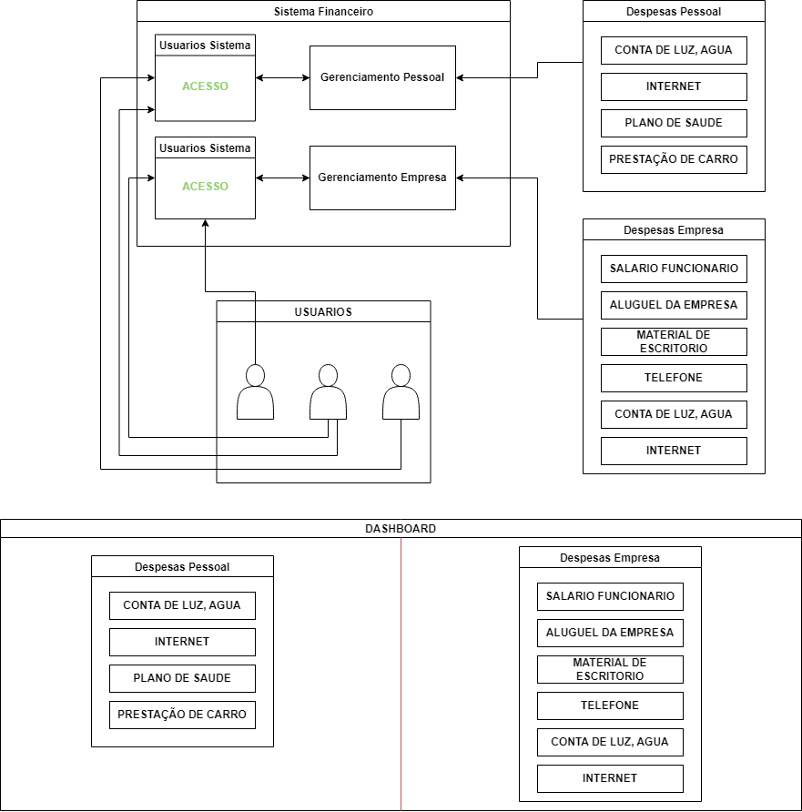

# Sistema Financeiro

Um Projeto de Sistema Financeiro para gerenciamento de finanças, tanto para uso pessoal quanto para empresas. O sistema é desenvolvido utilizando a tecnologia .NET 8.0 e Sql Server para persistência de dados. As APIs são construídas utilizando WebApi, com uma arquitetura dividida em diferentes camadas: Domain, Entities, Helpers e WebApis.

## Estrutura de Pastas e Projetos

O projeto está organizado da seguinte forma:

### Funcionamento Relação dos Objetos do Sistema Financeiro

### 🖥️ Tecnologias Utilizadas
- 
- 

## Tecnologias Utilizadas em Back-End

- 🛡️ **Identity**: Utilizado para autenticação e autorização de usuários.
- 📝 **Linq C#**: Utilizado para realizar queries no banco de dados.
- 🔄 **Generics**: Aplicado para criar estruturas de dados e algoritmos reutilizáveis.
- 🔐 **JWT (JSON Web Token)**: Utilizado para autenticação e geração de tokens.
- 📦 **Dependency Injection (Singleton)**: Utilizado para gerenciar as dependências das classes.

## Objetos Relacionados ao Projeto

- **User**: Representa um usuário do sistema.
- **Categoria**: Representa uma categoria de despesa.
- **Despesa**: Representa uma despesa financeira.
- **SistemaFinanceiro**: Representa o sistema financeiro como um todo.
- **UsuarioSistemaFinanceiro**: Relaciona um usuário a um sistema financeiro.

## Funcionalidades Implementadas

1. **Validações no Domínio**: Implementadas regras de validação de dados e regras de negócio no domínio do sistema.
2. **Implementação de JWT e API de User com Identity**: Utilizado JWT para autenticação e autorização de usuários, integrado com Identity.
3. **Criação de APIs**: Criadas APIs para manipulação de usuários, tokens, categorias, despesas, sistemas financeiros e usuários do sistema financeiro.

## Arquitetura Utilizada

- **Domain**: Contém as regras de negócio, serviços e validações do sistema.
- **Infra**: Responsável pela interação com o banco de dados, execução das operações.
- **Helpers**: Implementa métodos auxiliares compartilhados entre diferentes partes da aplicação.
- **WebApis**: Camada de hospedagem das APIs disponíveis para interação com o front-end.

## Conclusão

O Sistema Financeiro desenvolvido oferece uma plataforma robusta para gerenciamento de finanças pessoais e empresariais, com APIs bem definidas e uma arquitetura organizada que facilita a manutenção e extensão do sistema. Utilizando tecnologias modernas como .NET 8.0 e SQL Server, o sistema garante segurança, escalabilidade e performance para os usuários.
